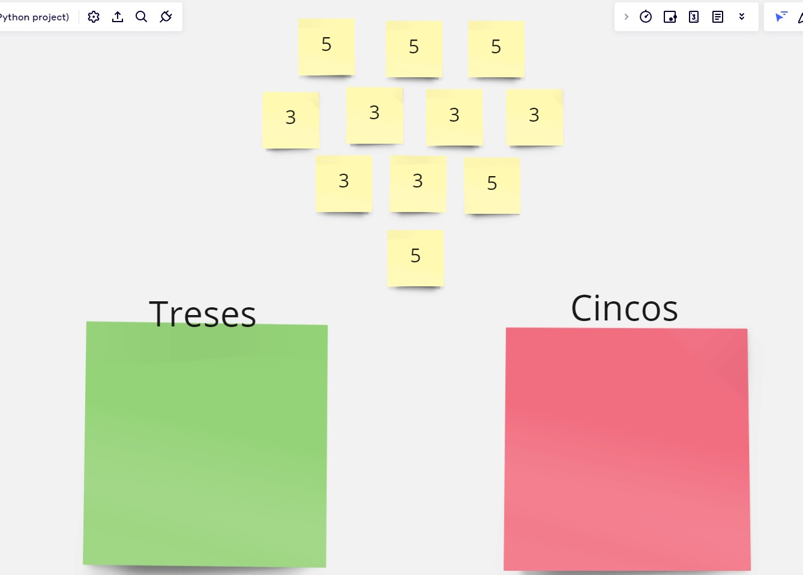

# **NUMBER RECOGNITION**

## *PRIMERA VERSION*

Gracias a python y a su librería pyautogui he conseguido realizar un reconocedor de números (hasta ahora solamente 3 y 5)

La primera version se ha realizado en *Miro* y los número se han colocado en cuadrados para la comprobación de la posición de los mismos.

Mas adelante se realizará una segunda versión en la que se podrá reconocer cualquier número y dichos números repartidos por el tablero
podrán ser realizados a mano para ver el potencial o la confianza a la hora de clasiificarlos.

La disposición de los números en el tablero es la siguiente:

Por el momento no está optimizado y es necesario que siempre se parta de esa disposición ya que el clasificador comienza situando el ratón en los posits
amarillos que estratégicamente se han colocado ahí. Como se ha mencionado, mas adelante se podrán repartir en cualquier disposición dichos números.

